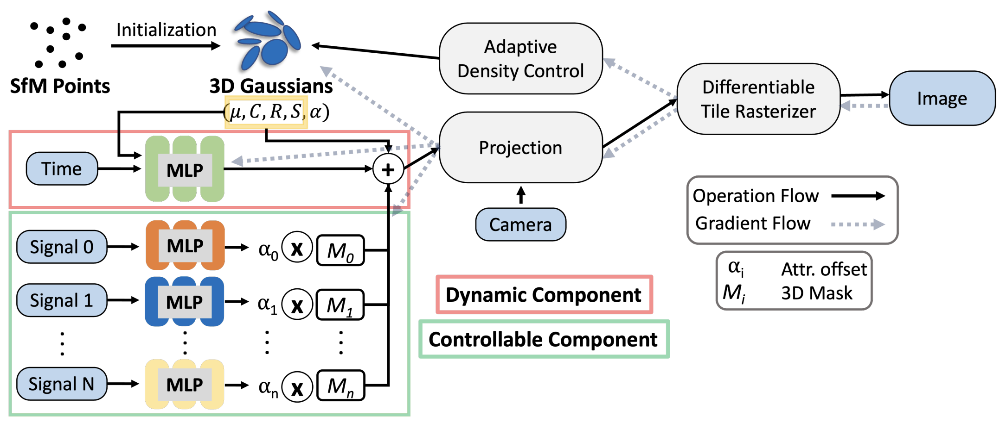

# CoGS: Controllable Gaussian Splatting
### [Project Page](https://cogs2023.github.io/) | [Paper](https://arxiv.org/abs/2312.05664) 

> [**CoGS: Controllable Gaussian Splatting**](https://arxiv.org/abs/2312.05664),            
> [Heng Yu](https://heng14.github.io/), [Joel Julin](https://joeljulin.github.io/), [Zoltan Á Milacski](https://scholar.google.com/citations?user=rSqodggAAAAJ&hl=es), [Koichiro Niinuma](https://scholar.google.com/citations?user=AFaeUrYAAAAJ&hl=en), [László A. Jeni](https://www.laszlojeni.com/)  
> **Arxiv preprint**

**This repository is the official implementation of "CoGS: Controllable Gaussian Splatting".** In this paper, we present CoGS, a method for Controllable Gaussian Splatting, that enables the direct manipulation of scene elements, offering real-time control of dynamic scenes without the prerequisite of pre-computing control signals.

## Pipeline
<div align="center">
  
</div><br/>

The code is coming soon! Stay tuned!


<!-- ## 📜 Reference
```bibtex
@article{yang2023gs4d,
  title={Real-time Photorealistic Dynamic Scene Representation and Rendering with 4D Gaussian Splatting},
  author={Yang, Zeyu and Yang, Hongye and Pan, Zijie and Zhu, Xiatian and Zhang, Li},
  journal={arXiv preprint arXiv 2310.10642},
  year={2023}
}
``` -->
